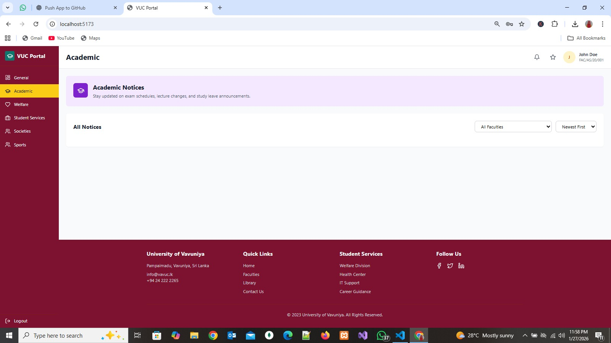
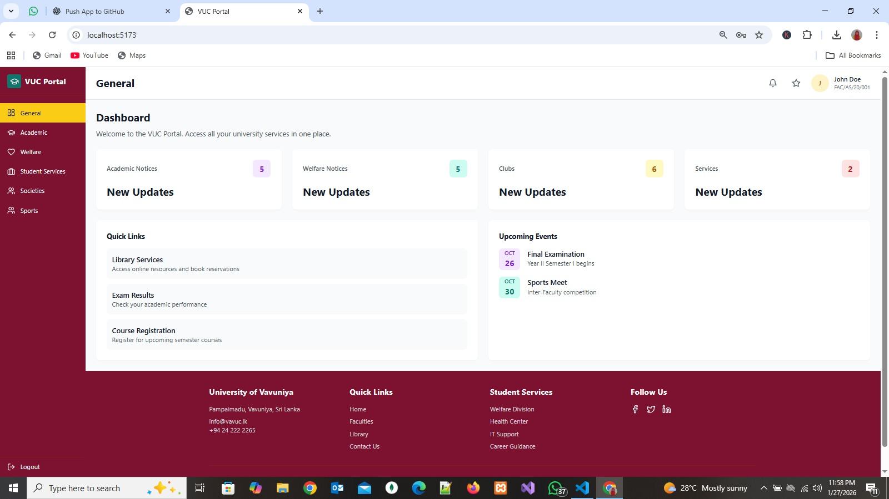
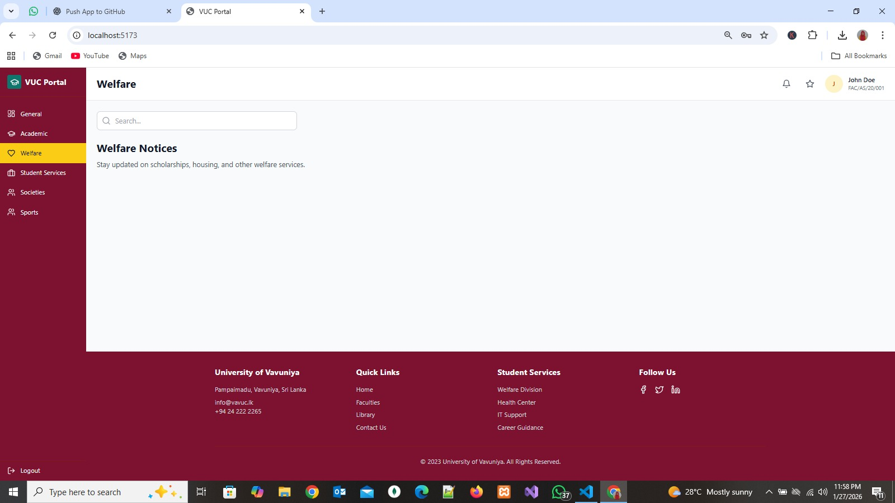

# Vavuniya University Connect

## Frontend Implementation

The frontend of Vavuniya University Connect was developed to provide
a clean and user-friendly interface for university students.

### Technologies Used
- React.js
- Vite
- TypeScript
- Tailwind CSS

### Features
- Student login interface
- Dashboard with notices
- Student services section
- Responsive UI

Frontend developed by **Jathusika**.

---

## Frontend Folder Structure

client/
├── public/
├── src/
│   ├── components/
│   ├── pages/
│   ├── services/
│   └── styles/
├── index.html
├── package.json
└── vite.config.ts

---

## How to Run the Frontend

### Prerequisites
- Node.js (v18 or later)
- npm

### Steps
```bash
cd client
npm install
npm run dev

## Screenshots

### Academic Notices



### Dashboard



### Student Societies


### Welfare Notices


